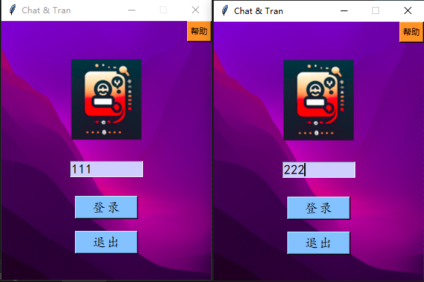
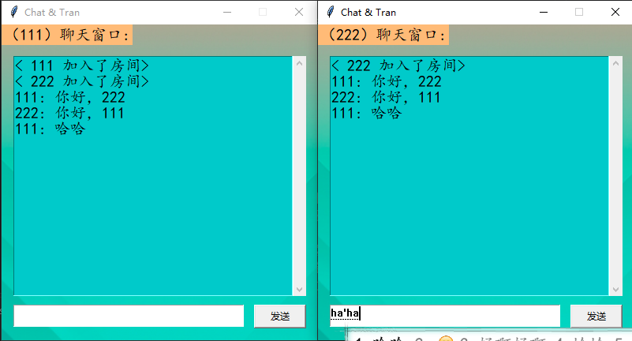
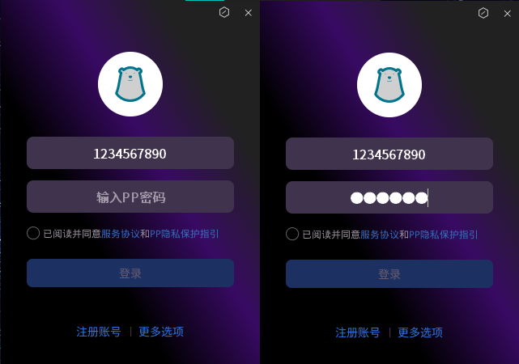
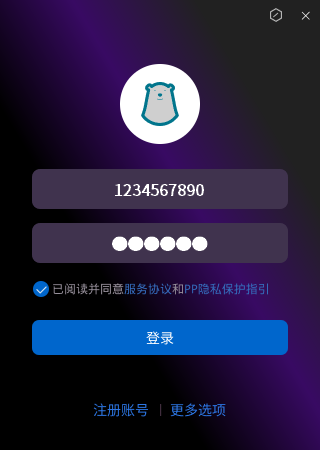

# Python 桌面GUI练习项目

> 项目为Python桌面GUI学习Demo，包含两套客户端程序：基于Tkinter的TCP聊天室、基于PyQt5仿登录客户端界面。用于练习桌面UI开发、TCP网络通信、事件处理、窗口自定义等技术。

## 项目简介
本仓库是个人Python桌面端练手项目，主要用来学习GUI客户端开发。
1. `app_client.py`：**Tkinter实现多人聊天室客户端**，基于Telnet/TCP Socket完成网络通信；具备登录、消息收发、在线用户查询、异常处理、窗口管理等完整交互逻辑。
2. `app.py`：**PyQt5仿登录界面Demo**，无边框自定义窗口，复刻登录客户端视觉效果，练习Qt控件、信号槽、窗口拖拽、样式表、动态状态切换。

> ⚠️ 声明：`app.py`仅为技术学习Demo，仅用于编程练习，非真实产品，不提供实际账号登录能力。

## ✨ 功能特性
### 📡 Tkinter TCP聊天室（app_client.py）

- 登录窗口：昵称输入、回车快捷登录、鼠标悬浮按钮样式、帮助弹窗
- TCP网络通信：基于`telnetlib + socket`与后端服务交互，登录校验、用户名重复检测
- 聊天主窗口：滚动文本消息框，发送消息、回车快捷发送
- 网络健壮处理：捕获socket异常、连接超时、TCP粘包拆包缓冲区处理
- 窗口生命周期：关闭窗口主动发送logout指令，释放网络连接资源
- 工具能力：窗口居中算法，base64背景图片解码渲染

### 🎨 PyQt5 仿登录界面（app.py）

- 无边框自定义窗口，自定义背景图、窗口图标
- 自定义控件：头像、账号密码输入框，密码隐藏显示，占位提示文本
- 鼠标拖拽移动无边框窗口，重写鼠标事件 `mousePressEvent/mouseMoveEvent/mouseReleaseEvent`
- QSS样式表美化控件，透明输入框、自定义密码掩码字符
- 动态状态检测：定时器实时检测输入框内容，切换登录按钮可用状态
- 勾选协议交互逻辑，按钮图标状态切换
- 资源路径兼容：支持本地运行 + PyInstaller打包后的资源路径适配 `resource_path()`
- 预留登录、注册服务对接接口，可扩展网络逻辑

## 🛠 技术栈
- Python 3.8+
- GUI：`Tkinter` / `PyQt5`
- 网络：`socket`、`telnetlib`、TCP
- 图像处理：`Pillow(PIL)`，base64图片解码
- Qt相关：QWidget、QTimer、QPainter、QSS样式表、信号槽机制
- 打包兼容：适配PyInstaller打包exe资源路径问题